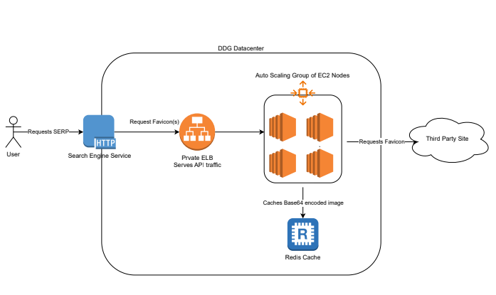

# favicon_service



## Overview

This repo encompasses an API designed to retrieve the favicon for the requested domain.  This API is intended for use as a private service for DuckDuckGo systems to retrieve data urls for the requested icons.  These icons would then be returned to the user as part of a search results page.

A request for `/favicon/https:duckduckgo.com` should result in a JSON object containing the data url.  The JSON object will be formatted according to the [JSON API Specification](https://jsonapi.org/).  A Swagger definition for the API can be found in the file `swagger.yaml`.

## Running the service locally

The first thing we want to do is ensure that you have the right version of python installed on your system.  Using a tool like pyenv can be helpful for this.  The current python version is listed in our .python-version file.  Using pyenv we can install that version like so: `pyenv install <version>`

Next we want to setup and enable our virtualenv.  Virtual environments allow us to isolate our applications dependencies from our system defaults or other applications.  The following commands will setup our virtual environment, activate it, and install our dependencies:

```
python3 -m venv .venv
. .venv/bin/activate
pip install -r requirements.txt
```

If we want to test with caching enabled locally we will need to run our development redis server.  We can accomplish this with docker compose.  Ensure that you have docker installed on your computer and run the following command.

`docker compose -f docker-compose-redis.yml up`

Finally we can run our service!  The following commands set our development specific settings and run the service:

```
export $(xargs < configs/local.env)
python manage.py runserver
```

## Testing

### Unit Tests

We can validate that our code is working as expected through Unit Tests.  The main tests for this project are defined in `api/tests.py`.  You can run the unit tests with the following command:

`python manage.py test`

### Load Tests

Details about how we can perform load tests can be found in the `load_testing` folder.

## Infrastructure

We manage this applications infrastructure through Terraform.  In the `infra` folder you will find a terraform module that creates all the relevant infrastructure for this application.  Also in the infra folder you will find the bootstrap script used to provision a new Ubuntu 20.04 server and run our application.

In order to plan/apply this infrastructure you will need to set your AWS environment variables and execute the following terraform commands like so:

```
export AWS_ACCESS_KEY_ID=<YOUR ACCESS KEY>
export AWS_SECRET_ACCESS_KEY=<YOUR SECRET KEY>
export AWS_DEFAULT_REGION=<YOUR AWS_REGION>
terraform init
terraform plan -var-file="prod.tfvars"
terraform apply -var-file="prod.tfvars"
```

## Future Improvements

While this project is 100% functional there are always optimizations that we can make.  This section will give a brief overview of some of those possible optimizations

### Build system

We will want to integrate this application with the organization's Build System.  This will allow us to "build" our application and keep our application artifacts in one common software repository.  For this application in particular it would be as simple as compressing the file into a tarball and uploading to the artifact storage location.

### Logging

Since we are running our service with systemd our logs are available through the `journalctl` utility.  However keeping logs directly on the server is a bad practice.  We should be offloading our logs to a centralized logging system.  One way that this can be done is via rsyslog.  In particular for Elasticsearch there is a module [omelasticsearch](https://www.rsyslog.com/doc/v8-stable/configuration/modules/omelasticsearch.html) that provides native support for sending logs directly to Elasticsearch.

### Packer

The current bootstrap script works great, however it can take a long time to execute.  This means that our servers take longer to provision and can affect application availability.  We can utilize Packer to build AMIs baked with all of our required software.  Then when we need a new server, we boot that AMI, upload the latest version of the code onto the host, and start our service.  A POC of the Packer configuration can be found in the `packer/` folder.
